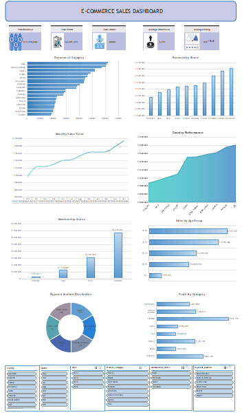
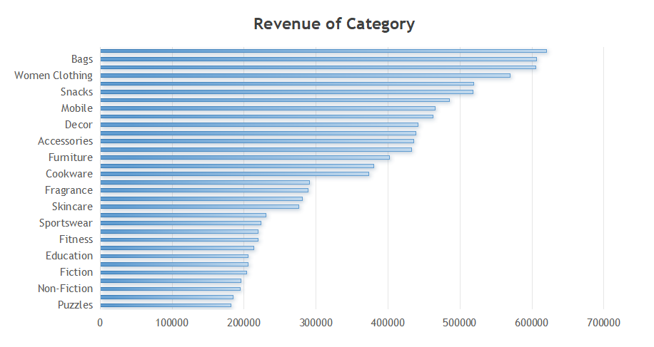
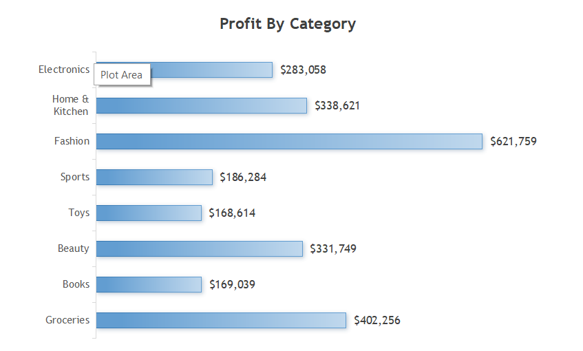
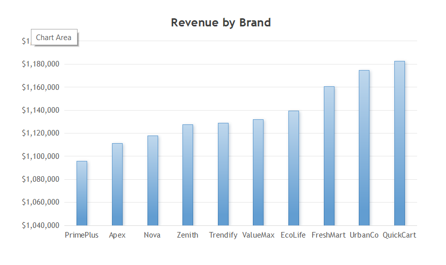
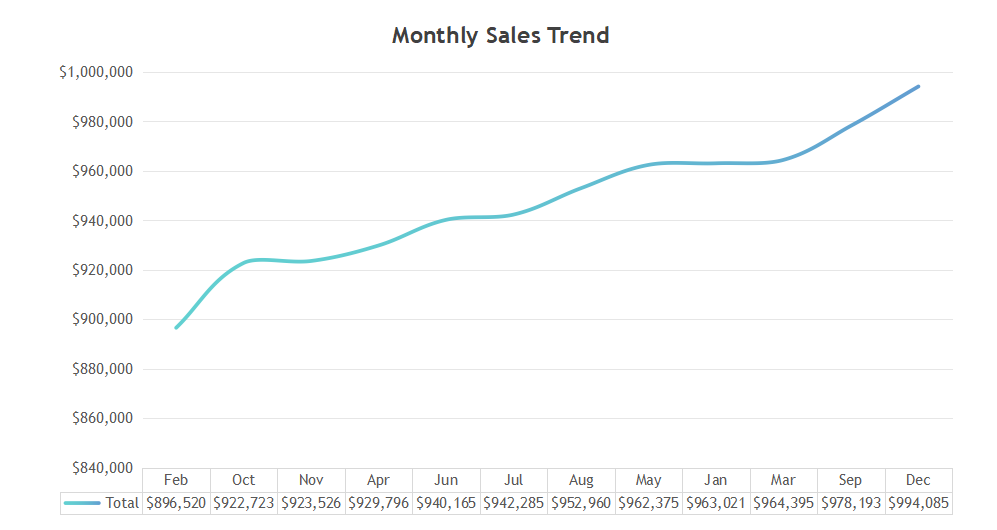
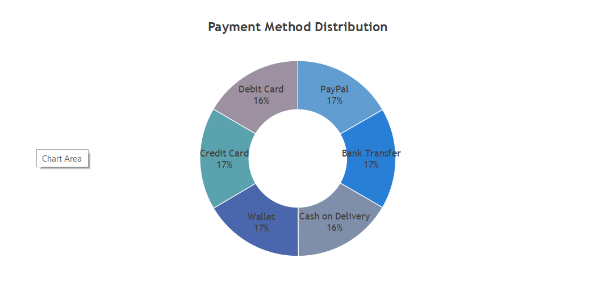
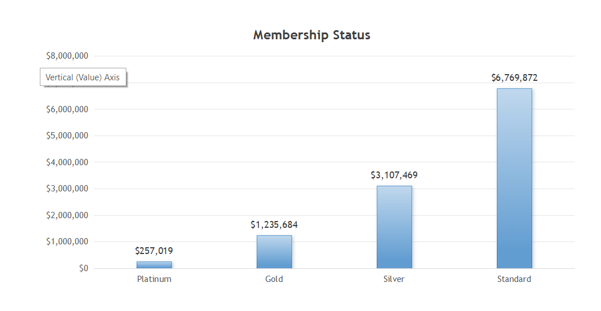

# 📊 E-Commerce Sales Dashboard Analysis

## 📌 Project Overview

This project presents an end-to-end analysis of an e-commerce sales dataset using WPS Spreadsheet. The project demonstrates the complete data analytics workflow, including data cleaning, feature engineering, pivot table analysis, KPI development, and dashboard creation.

The final dashboard enables users to interactively explore sales performance through slicers and visualizations.

---

## 🎯 Objectives

- Clean and validate raw e-commerce data.
- Analyze revenue and profitability.
- Identify top-performing products and brands.
- Explore customer purchasing behavior.
- Build an interactive dashboard for business decision-making.

---

## 🛠 Tools Used
-Microsoft Excel
- WPS Spreadsheet
- Pivot Tables
- Pivot Charts
- Slicers
- Data Cleaning
- GitHub

---

## 📂 Dataset

**Source:** Kaggle

The dataset contains approximately:

- 30,000 Orders
- 41 Columns

Including:

- Customer Information
- Product Details
- Order Information
- Revenue
- Profit
- Payment Methods
- Membership Status
- Review Ratings

---

# 📊 Dashboard Preview


## Ecommerce Dashboard















---

# 📈 KPIs

| KPI | Value |
|------|-------:|
| Total Revenue | **$11.37M** |
| Total Profit | **$2.50M** |
| Total Orders | **30,000** |
| Average Order Value | **$379** |
| Average Rating | **4.0 / 5** |

---

# 📊 Dashboard Features

- Revenue by Category
- Revenue by Brand
- Monthly Sales Trend
- Revenue by Country
- Membership Status
- Payment Method Distribution
- Sales by Age Group
- Profit by Category

---

# 🔄 Project Workflow

```
Raw Dataset
│
▼
Data Cleaning
│
▼
Feature Engineering
│
▼
Business Questions
│
▼
Pivot Tables
│
▼
KPI Development
│
▼
Interactive Dashboard
│
▼
Business Insights
```

---

# 💡 Key Insights

- Bags generated the highest revenue among product categories.
- QuickCart achieved the highest revenue among brands.
- Sales increased steadily throughout the year.
- Customers aged 36–45 generated the highest revenue.
- Standard members contributed the highest sales.
- The corrected profit calculation resulted in realistic profitability metrics.

---

# 📁 Repository Structure

```
Ecommerce-Sales-Analysis
│
├── Data
├── Dashboard
├── Images
├── Reports
└── README.md
```

---

# 👤 Author

**Jeric Cabalde**

Aspiring Data Analyst

- Excel
- WPS Spreadsheet
- MySQL 
- Power BI (Learning)
